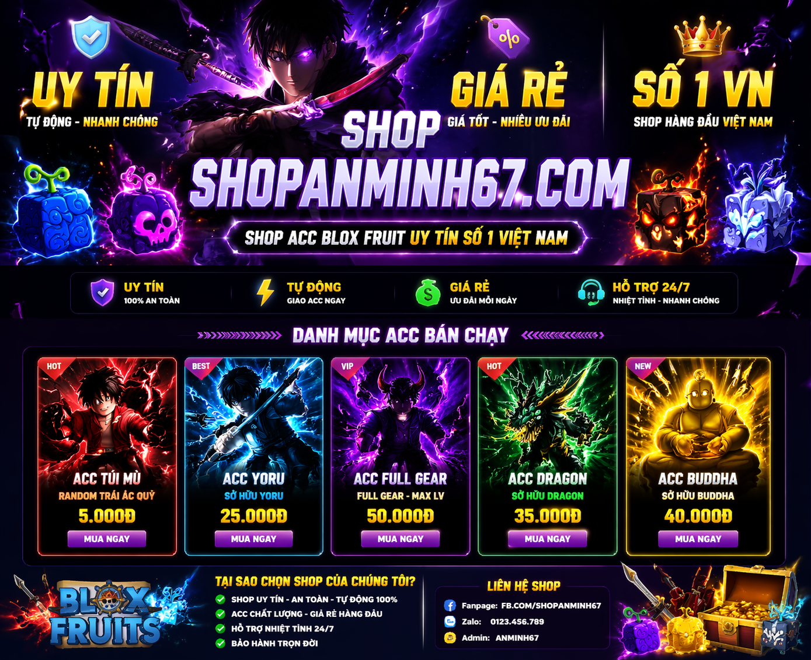

# shopanminh67.com
<!DOCTYPE html>
<html lang="vi">
<head>
<meta charset="UTF-8">
<title>Shop Acc Blox Fruit</title>

</head>

<body>

<!-- BANNER -->

    

<!DOCTYPE html>
<html lang="vi">
<head>
<meta charset="UTF-8">
<title>Image Zoom Popup</title>

</head>

<body>

  

</body>
</html>

<h1>🔥 SHOP ACC BLOX FRUIT 🔥</h1>

<!-- SHOP -->

    <!-- SẢN PHẨM -->
    

        

        <h2>Acc túi mù</h2>
        
Chỉ còn: 5.000đ

        <button onclick="buy()">Mua ngay</button>

    

<!-- POPUP -->

    

        <h2>Thanh toán</h2>
        
STK: <b>0987654321</b>

        
Ngân hàng: ACB 

        
Tên: ĐẬU XUÂN MAI /p>
        
Nội dung: muaacc

        <button onclick="closePopup()">Đóng</button>
    

</body>
</html>
